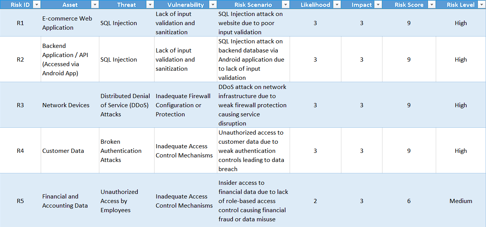
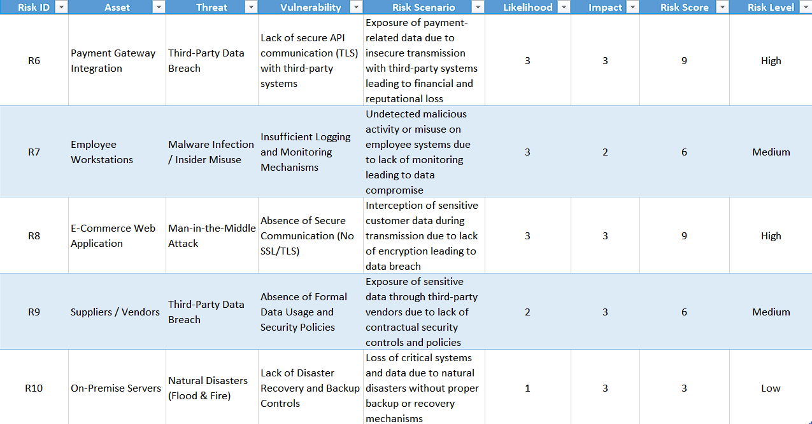
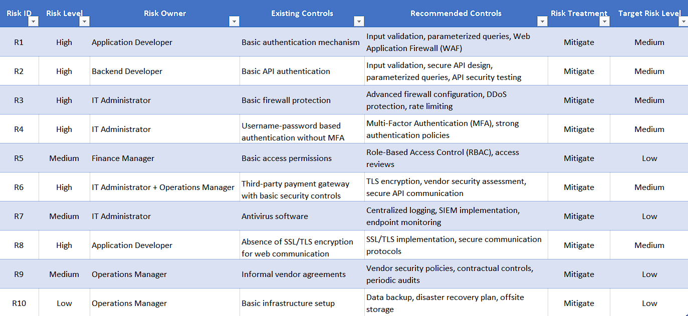
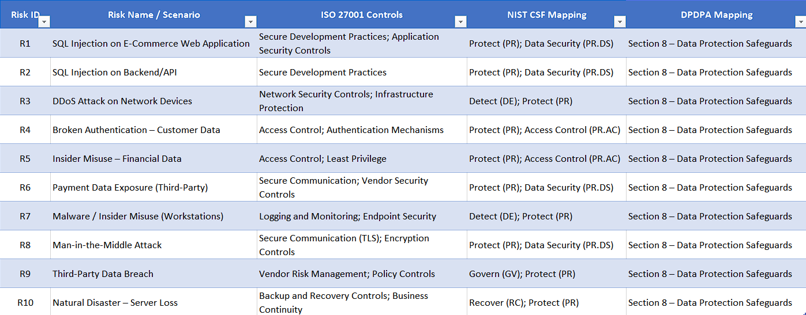
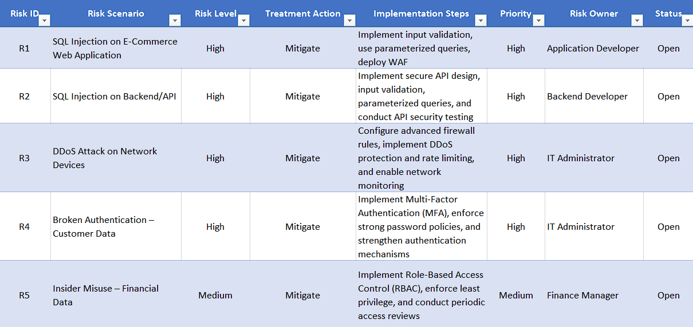
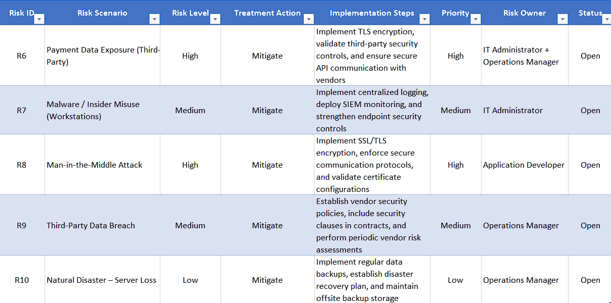

# End-to-End Enterprise IT Risk Management

## Risk Assessment, Control Mapping & Risk Treatment (ISO 27001, NIST CSF, DPDPA)

---

### Project Overview

This project demonstrates a complete **Enterprise IT Risk Management process** for a small e-commerce organization (KR Shopping Pvt Ltd).

The objective is to identify, assess, and manage cybersecurity risks using structured GRC practices aligned with:

* ISO 27001 (Control Areas)
* NIST Cybersecurity Framework (CSF)
* Digital Personal Data Protection Act (DPDPA – India)

This project simulates real-world enterprise risk management practices and decision-making processes.

---

### Organization Context

* **Industry:** E-Commerce & Retail
* **Size:** Small Enterprise (~100 employees)
* **Operations:** Online platform + 5 retail outlets in Chennai
* **Key Systems:**

  * E-Commerce Web Application
  * Android Application
  * Backend API
  * Payment Gateway
  * Cloud Infrastructure

---

### Project Scope

The following GRC activities were performed:

1. Define Organization Context
2. Identify Assets
3. Identify Threats
4. Identify Vulnerabilities
5. Perform Risk Assessment (Likelihood × Impact)
6. Create Risk Register
7. Map Controls (ISO 27001, NIST CSF, DPDPA)
8. Develop Risk Treatment Plan

---

### Asset Identification

#### Hardware Assets

* POS Systems (Retail Outlets)
* Employee Workstations
* CCTV Surveillance Systems
* On-Premise Servers
* Network Devices (Routers, Switches, Wi-Fi)
* Printers

#### Software / Applications

* E-Commerce Web Application
* Backend Application / API
* Admin Panel
* Payment Gateway Integration
* Cloud Hosting Environment

#### Data Assets

* Customer Data (PII)
* Order & Transaction Data
* Financial & Accounting Data
* Supplier & Vendor Data

#### People / Users

* Retail Staff
* IT Personnel
* Finance Team
* Sales & Marketing Team

#### Third-Party / Vendors

* Suppliers / Vendors
* Delivery Partners
* Payment Gateway Provider

---

### Threat Identification

#### Application-Level Threats

* SQL Injection
* Broken Authentication
* Data Exposure / Improper Encryption
* Insufficient Logging
* Man-in-the-Middle Attack

#### Network & System Threats

* Malware Infection
* Ransomware Attacks
* DDoS Attacks
* Phishing Attacks

#### Human / Insider Threats

* Unauthorized Access
* Insider Data Misuse
* Accidental Data Leakage

#### Physical Threats

* Theft of Devices
* Natural Disasters (Flood / Fire)

#### Third-Party Threats

* Vendor Data Breach
* Unauthorized Data Sharing

---

### Vulnerability Identification

#### Application & API Risks

* Lack of input validation and sanitization
* Absence of secure API communication (No TLS)

#### Access Control Risks

* Weak authentication (No MFA)
* Lack of Role-Based Access Control (RBAC)

#### Network & Infrastructure Risks

* Inadequate firewall configuration
* Weak Wi-Fi security

#### Monitoring Risks

* No centralized logging / SIEM

#### Data Protection Risks

* Unencrypted data transmission
* Unsecured databases

#### Organizational Risks

* Lack of security awareness training
* Absence of data protection policies

#### Physical & Continuity Risks

* Poor physical security controls
* No backup / disaster recovery plan

---

### Risk Assessment

Risks were identified using:

**Asset + Threat + Vulnerability = Risk Scenario**

Each risk was evaluated using:

* Likelihood (1–3)
* Impact (1–3)

**Risk Score = Likelihood × Impact**

---

### Risk Register

A structured risk register was developed to manage and track identified risks.

The risk register includes:

* Risk ID and risk level  
* Assigned risk owner  
* Existing security controls  
* Recommended controls for mitigation  
* Risk treatment strategy (Mitigate)  
* Target risk level after implementing controls

This enables effective tracking, prioritization, and accountability of risks across the organization.

The detailed risk scenarios (asset, threat, vulnerability relationships) are documented in the Risk Assessment file.

---

### Control Mapping Approach

Each risk was mapped to:

* **ISO 27001 Control Areas**
  (Secure Development, Access Control, Encryption, Vendor Security)

* **NIST CSF Functions**
  (Protect, Detect, Govern, Recover)

* **DPDPA Requirements**
  (Section 8 – Data Protection Safeguards)

---

### Risk Treatment Plan

* High Risks → Immediate mitigation
* Medium Risks → Planned mitigation
* Low Risks → Monitoring and control improvement

Each risk includes:

* Implementation steps
* Risk owner
* Priority
* Status tracking

This ensures risks are actively managed and reduced to acceptable levels.

---

### Project Files

#### Excel Files

* `01_Risk_Assessment.xlsx`
* `02_Risk_Register.xlsx`
* `03_Control_Mapping.xlsx`
* `04_Risk_Treatment_Plan.xlsx`

---

### Screenshots

#### Risk Assessment

#### Risk Register

#### Control Mapping

#### Risk Treatment Plan

---

### Business Impact

The identified risks can significantly affect the organization in the following ways:

- Data breaches leading to loss of customer trust
- Financial loss due to fraud or system downtime
- Regulatory penalties under DPDPA
- Operational disruption in e-commerce services
- Reputational damage impacting long-term business growth

---

### Key Learnings

* End-to-end enterprise risk assessment
* Practical GRC implementation
* Mapping risks to compliance frameworks
* Developing and tracking mitigation strategies
* Understanding the relationship between technical risks and business impact

---

### Conclusion

This project demonstrates a structured and practical approach to enterprise IT risk management. 

By identifying risks, mapping them to industry frameworks (ISO 27001, NIST CSF, and DPDPA), and defining actionable treatment plans, the project highlights the ability to align cybersecurity risks with business and compliance requirements.

This approach reflects real-world GRC practices used to improve organizational security posture and risk visibility.

---
