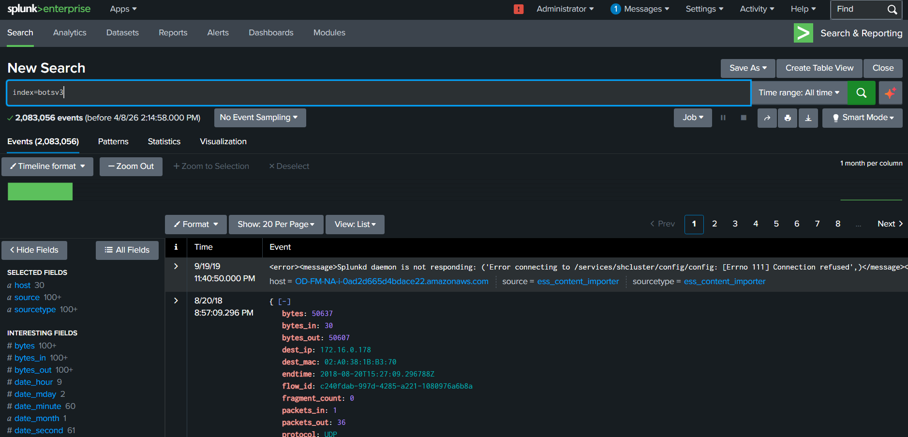
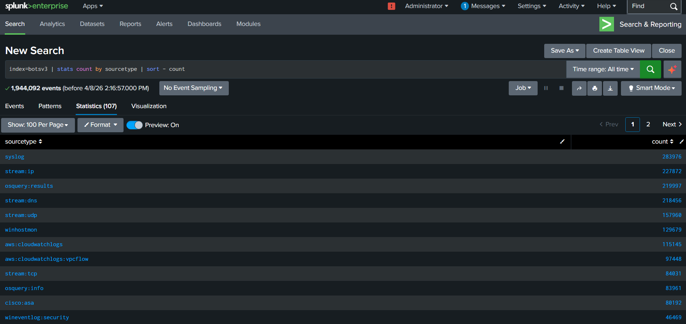
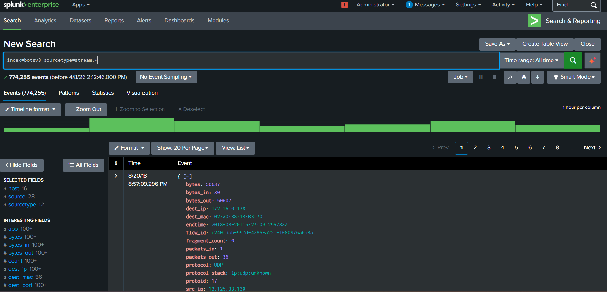
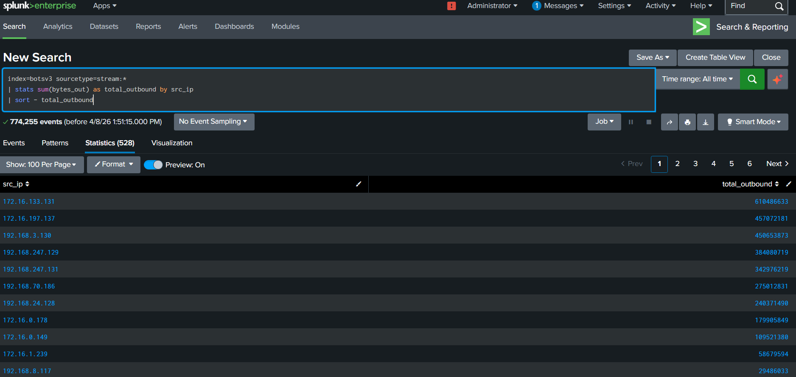
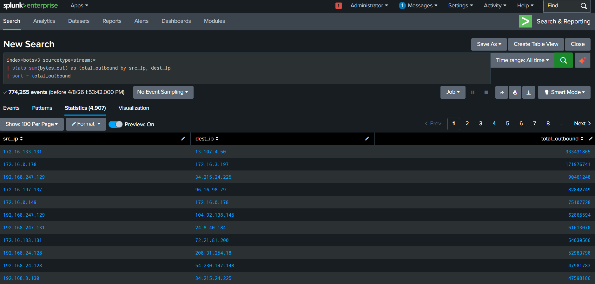
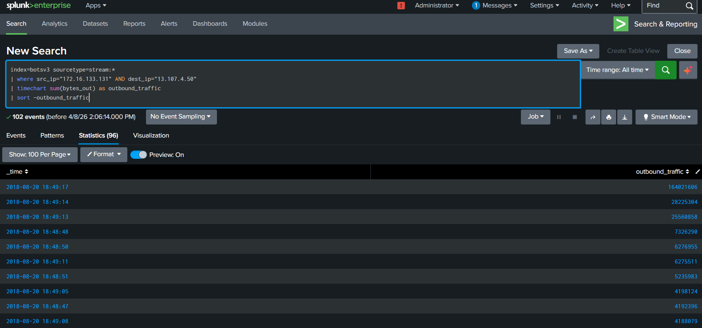
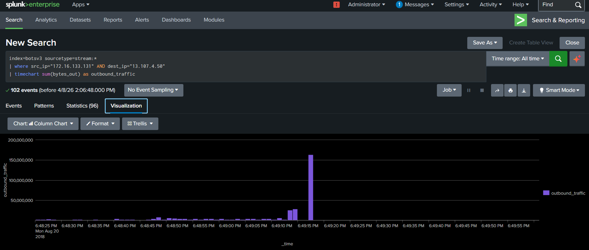
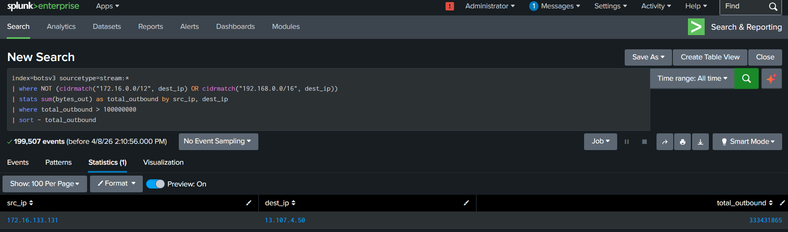

# Data Exfiltration Detection using Splunk (BOTS v3)

---

## Executive Summary

This project analyzes network traffic logs from the BOTS v3 dataset using Splunk to detect potential data exfiltration activity. The analysis identified a system sending a large volume of data to an external IP address, supported by a sudden spike in outbound traffic, indicating suspicious behavior that may pose a security risk.

---

## Project Overview

In this project, I used Splunk Enterprise and the BOTS v3 dataset to analyze network traffic and identify abnormal data transfer behavior.

The main goal of this project is to monitor outbound traffic and detect suspicious data movement from internal systems to external destinations.

---

## Objective

* Analyze network traffic logs
* Identify systems generating high outbound data
* Detect communication with external IP addresses
* Identify abnormal traffic patterns
* Detect potential data exfiltration

---

## Tools Used

* Splunk Enterprise
* BOTS v3 Dataset
* SPL (Search Processing Language)

---

## Dataset

* BOTS v3 dataset (Splunk Boss of the SOC)
* Contains multiple log sources like:

  * Network traffic logs (stream data)
  * Windows Event Logs
  * DNS, Syslog, etc.

---

## Step-by-Step Approach

### 1️⃣ Data Ingestion

* Loaded BOTS v3 dataset into Splunk
* Created index: `botsv3`
* Verified data:

```
index=botsv3
---

Loaded the BOTS v3 dataset into Splunk and created the botsv3 index. Verified that the data is successfully ingested and searchable.
---


### 2️⃣ Understanding the Data

* Identified available sourcetypes:

```
index=botsv3 | stats count by sourcetype
```

* Focused on network logs:

```
stream:*
```

Explored the dataset to understand available log sources. Identified different sourcetypes and selected network traffic logs for further analysis.
---


### 3️⃣ Exploring Network Data

* Verified key fields for analysis:

```
index=botsv3 sourcetype=stream:*
```

* Identified important fields:

  * src_ip
  * dest_ip
  * bytes_out
  * bytes_in

---
Analyzed stream-based network logs to identify key fields such as source IP, destination IP, and outbound data size. These fields are important for detecting data exfiltration.
---


### 4️⃣ Identifying Top Data Senders

* Detected systems sending highest outbound data:

```
index=botsv3 sourcetype=stream:*
| stats sum(bytes_out) as total_outbound by src_ip
| sort - total_outbound
```
Analyzed outbound traffic to identify systems sending the highest amount of data. This helps in detecting unusual or suspicious data transfer behavior.
---


### 5️⃣ Source and Destination Analysis

* Analyzed data flow between systems:

```
index=botsv3 sourcetype=stream:*
| stats sum(bytes_out) as total_outbound by src_ip, dest_ip
| sort - total_outbound
```
Correlated source and destination IP addresses to understand data flow. This helps identify where the data is being sent and detect suspicious communication paths.
---


### 6️⃣ Filtering External Traffic

* Removed internal traffic using CIDR:

```
index=botsv3 sourcetype=stream:*
| where NOT (
    cidrmatch("172.16.0.0/12", dest_ip) OR
    cidrmatch("192.168.0.0/16", dest_ip)
)
| stats sum(bytes_out) as total_outbound by src_ip, dest_ip
| sort - total_outbound
```
Filtered out internal network traffic using CIDR ranges to focus only on external communication. This helps in identifying potential data leaving the organization.
---


### 7️⃣ Time-Based Analysis

* Analyzed traffic pattern over time:

```
index=botsv3 sourcetype=stream:*
| where src_ip="172.16.133.131" AND dest_ip="13.107.4.50"
| timechart sum(bytes_out) as outbound_traffic
```
Analyzed traffic patterns over time to detect sudden spikes in outbound data. Such spikes may indicate abnormal or suspicious activity.
---


### 8️⃣ Final Detection Logic

* Created detection rule for high outbound traffic:

```
index=botsv3 sourcetype=stream:*
| where NOT (
    cidrmatch("172.16.0.0/12", dest_ip) OR 
    cidrmatch("192.168.0.0/16", dest_ip)
)
| stats sum(bytes_out) as total_outbound by src_ip, dest_ip
| where total_outbound > 100000000
| sort - total_outbound
```
Created a detection rule to identify high-volume outbound traffic to external IPs. Applied a threshold to highlight potential data exfiltration events.
---

## Key Findings

* Identified systems generating high outbound traffic
* Detected communication between internal and external IPs
* Found a suspicious system:

  * **172.16.133.131 → 13.107.4.50**
* Data transferred: **~333 MB**
* Observed sudden spike in outbound traffic

---

## Security Insight

This behavior indicates potential data exfiltration.

Possible reasons:

* Data theft
* Malware communication
* Unauthorized data transfer

This is a **high-risk security event**.

---

## Why This Activity is Suspicious

* Large volume of outbound data
* Communication with external IP
* Sudden spike in traffic
* Not typical for normal system behavior

These indicators strongly suggest potential exfiltration activity.

---

## Visualization

* Created time-based chart to show traffic spike
* Helps identify abnormal behavior clearly

---

## Business Impact

* Data leakage to external entities
* Loss of sensitive information
* Regulatory and compliance risks
* Damage to organization reputation

---

## Risk Assessment

* Likelihood: High
* Impact: High
* Overall Risk: High

---

## Recommendations

* Monitor outbound traffic continuously
* Implement data loss prevention (DLP)
* Set alerts for high data transfer
* Restrict unauthorized external communication
* Perform regular log analysis

---

## What I Learned

* How to analyze network traffic logs in Splunk
* How to identify important fields for detection
* How to detect abnormal outbound traffic
* How to filter internal vs external traffic using CIDR
* How to detect data exfiltration using SIEM

---

## Conclusion

In this project, I analyzed network traffic logs and detected potential data exfiltration using Splunk.

I identified a system sending a large volume of data to an external IP and confirmed suspicious behavior using time-based analysis.

This project helped me understand real-world network monitoring and how to detect security threats using SIEM tools.

---

## Project Screenshots

### 🔹 Data Ingestion



### 🔹 Sourcetype Analysis



### 🔹 Stream Data Exploration



### 🔹 Top Data Senders



### 🔹 Source-Destination Analysis



### 🔹 External Communication



### 🔹 Traffic Spike Analysis



### 🔹 Final Detection



---

